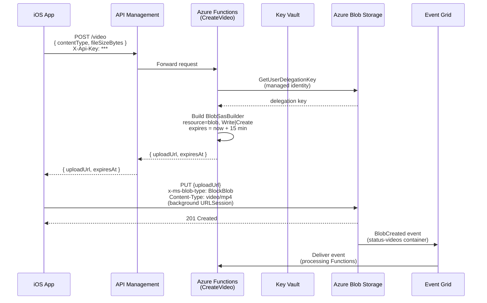

# 002 - Direct-to-Blob Upload via SAS URL

**Status:** Proposed

**Date:** 2026-03-22

---

## Context

Naked Standup requires team members to upload recorded status videos from an iOS
device to cloud storage so that server-side processing (transcoding, captions,
transcripts) can begin. The upload must be resilient to network interruptions,
support background transfer while the app is suspended, and avoid exposing long-lived
storage credentials to the client.

Two upload approaches were evaluated:

- **Proxy upload** — The iOS app uploads the video file to the API layer, which
  streams or re-uploads the bytes to Azure Blob Storage on the client's behalf.
  This is simple from the client's perspective but routes all video traffic through
  the API tier, adding latency and cost. The API server becomes a bottleneck for
  large binary payloads and must be sized to handle concurrent multi-megabyte
  streams.

- **Direct-to-blob upload via SAS URL** — The iOS app first requests a short-lived
  Shared Access Signature (SAS) URL from the API. The API generates the SAS URL
  using the Function App's managed identity, so no storage account key is ever
  stored or transmitted. The client then uploads the video directly to Azure Blob
  Storage using the SAS URL. The API never handles binary video data.

---

## Decision

We will use **direct-to-blob upload via SAS URL** for all video uploads.

The SAS URL is generated by an Azure Function (`CreateVideo`) exposed through
Azure API Management with API key authentication. The Function App uses a
system-assigned managed identity with the **Storage Blob Delegator** and
**Storage Blob Data Contributor** RBAC roles to produce a user delegation SAS
— the most secure SAS type available, requiring no storage account keys.

The iOS client sends a `POST /video` request (with `Content-Type` and file size),
receives a time-limited SAS URL, and then uploads the video file directly to
Azure Blob Storage using a `PUT` request with a `URLSession` background transfer.

Server-side processing is decoupled from the upload via **Azure Event Grid**. A
system topic monitors the `status-videos` Blob Storage container for
`BlobCreated` events and routes them to downstream processing Functions
(transcoding, captions, transcripts).

---

## Architecture



---

## iOS Client Upload Flow

The iOS client implements a two-step flow co-ordinated by `UploadService`:

1. **SAS URL request** — `SasUrlClient` sends `POST /video` to the API and
   decodes the `SasUrlResponse` containing `uploadUrl` and `expiresAt`.

2. **Background upload** — `BackgroundUploadExecutor` starts a `URLSession`
   background upload task (`PUT` to the SAS URL) with
   `x-ms-blob-type: BlockBlob` and `Content-Type: video/mp4` headers. The
   task is tracked by `URLSession` task identifier so that progress and
   completion callbacks survive app suspension.

3. **Retry handling** — If the upload fails with a transient error (timeout,
   network connection lost, not connected to Internet), `UploadService`
   schedules a retry with exponential back-off (`2^retryCount` seconds, up to
   a maximum of three retries). If the SAS URL has expired at retry time, a
   fresh SAS URL is fetched before the retry upload begins.

4. **Cancel handling** — A pending or in-progress upload can be cancelled at
   any time. Cancellation transitions the `UploadTask` state machine to
   `.cancelled` and calls `URLSession.cancel()` on the underlying task.

```swift
// UploadService — simplified submit flow
func submit(videoAt fileURL: URL) async throws {
    let task = UploadTask(videoFileURL: fileURL)
    uploadTasks.append(task)
    try await startUpload(for: task)
}

private func startUpload(for task: UploadTask) async throws {
    // Re-use a valid cached SAS URL or fetch a new one
    if task.sasURL == nil || task.sasExpiresAt.map({ $0 <= Date() }) == true {
        let response = try await sasUrlClient.fetchSasUrl(
            for: SasUrlRequest(contentType: "video/mp4",
                               fileSizeBytes: fileSize(at: task.videoFileURL)))
        task.sasURL = URL(string: response.uploadUrl)
        task.sasExpiresAt = ISO8601DateFormatter().date(from: response.expiresAt)
    }
    try task.transition(to: .uploading)
    launchUpload(for: task, to: task.sasURL!)
}
```

---

## Consequences

### Positive

- The API tier never handles binary video data, eliminating a throughput
  bottleneck and reducing networking cost.
- Azure Blob Storage handles large file uploads natively with reliable chunked
  transfer and automatic retry at the storage layer.
- User delegation SAS requires no storage account key management — no keys to
  rotate, no keys to store in Key Vault, no keys to leak.
- SAS URLs expire automatically (15 minutes), limiting the blast radius of an
  intercepted URL.
- `URLSession` background transfer survives app suspension and termination,
  ensuring uploads complete even if the user switches away from the app.
- Event Grid decouples upload completion from processing, allowing processing
  Functions to scale independently.

### Negative

- The client requires two network round trips before bytes begin transferring
  (SAS URL request + upload). On slow connections this may delay perceived
  upload start.
- SAS URL expiry must be actively managed: if an upload is queued or retried
  after the SAS URL has expired, the client must fetch a new one before
  retrying.
- Background `URLSession` completion events must be forwarded from
  `application(_:handleEventsForBackgroundURLSession:completionHandler:)` in
  the app delegate; missing this hook causes callbacks to be lost.

### Mitigations

- `UploadTask` caches `sasURL` and `sasExpiresAt`. `UploadService.startUpload`
  checks expiry before every upload attempt and transparently re-fetches if
  the cached URL has expired.
- Background session event forwarding will be implemented when the app
  delegate integration task is scheduled. Until then, uploads complete
  correctly when the app is in the foreground.
