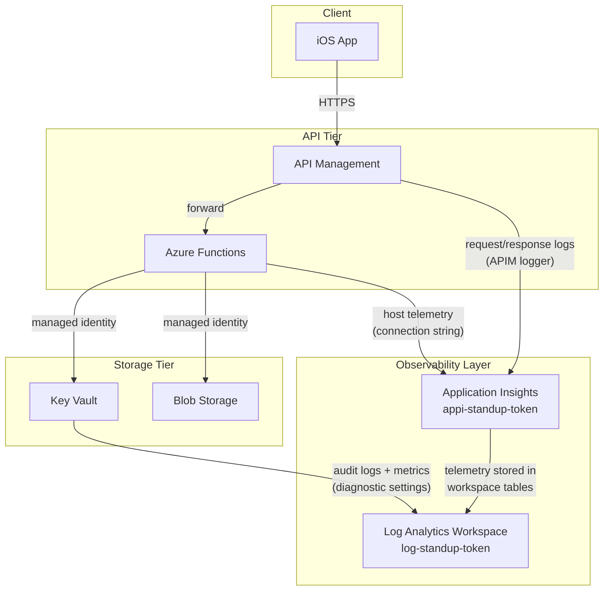

# 003 - Use Application Insights for Backend Observability

**Status:** Proposed

**Date:** 2026-03-23

---

## Context

Naked Standup's backend is composed of Azure Functions exposed through Azure API
Management, with supporting services in Azure Key Vault and Azure Blob Storage.
As the product moves toward a first user-facing release, the team needs visibility
into the behaviour of these services in production:

- Are API requests succeeding or failing, and how quickly?
- Are Azure Functions executing successfully, and how long do they take?
- Are there authentication or authorisation failures at the Key Vault level?
- When something goes wrong, what is the sequence of events that led to the failure?

Without centralised observability, diagnosing issues requires logging into multiple
Azure portal blades and manually correlating entries across services. This is slow
and error-prone, especially when investigating time-sensitive incidents.

### Observability options evaluated

| Option | Description |
|--------|-------------|
| **Azure Monitor Metrics only** | Every Azure resource emits platform metrics (request count, latency, error rate) to Azure Monitor at no extra cost. Metrics are aggregate; individual request traces and logs are not available. |
| **Classic Application Insights** | A standalone Application Insights resource stores telemetry in its own proprietary data store. End-of-life for classic workspaces is announced, and Microsoft recommends workspace-based instances for all new deployments. |
| **Workspace-based Application Insights** | Application Insights backed by a Log Analytics Workspace. Telemetry is stored in a standard Log Analytics table schema, enabling cross-resource KQL queries and unified log management alongside platform diagnostic logs. |
| **Third-party APM (Datadog, New Relic, etc.)** | Mature third-party APM platforms with rich dashboards and alerting. These require a separate commercial subscription, an additional data-pipeline integration, and vendor lock-in for a product that is already fully deployed on Azure. |

A key consideration is that Azure Functions and APIM have deep, first-party
integrations with Application Insights. Azure Functions automatically emits
host-level traces, dependency calls, exceptions, and custom events to Application
Insights with zero application-code changes. APIM can forward every inbound and
outbound request/response pair to an Application Insights logger, providing
end-to-end request visibility across the gateway and function layers.

---

## Decision

We will use **workspace-based Application Insights** backed by a **Log Analytics
Workspace** as the observability solution for the Naked Standup backend.

Concretely, this means:

- A single **Log Analytics Workspace** (`log-standup-{token}`) is provisioned.
  All diagnostic logs from all Azure resources are routed to this workspace,
  enabling cross-service KQL queries from a single location.

- A single **Application Insights** instance (`appi-standup-{token}`) is
  provisioned with `WorkspaceResourceId` pointing to the Log Analytics Workspace.
  The Application Insights instance is the telemetry entry-point for application-
  level data (requests, dependencies, traces, exceptions, custom events).

- The **Azure Functions** host is connected to Application Insights by setting the
  `APPLICATIONINSIGHTS_CONNECTION_STRING` application setting. The connection string
  is the recommended approach (over the legacy `APPINSIGHTS_INSTRUMENTATIONKEY`
  setting) because it avoids per-region AAD token acquisition overhead and supports
  local authentication.

- **API Management** is configured with an Application Insights logger resource
  (`applicationinsights-logger`) and a diagnostic resource (`applicationinsights`)
  that logs every request/response pair at 100% sampling with the `allErrors`
  always-log policy. 100% sampling is appropriate for a small-team product in
  its early stages; it can be reduced as request volume grows.

- **Key Vault** is configured with Azure diagnostic settings that route the
  `audit` category group (secrets access, policy changes, authentication events)
  and `AllMetrics` to the Log Analytics Workspace.

- **Azure Blob Storage** has no additional diagnostic configuration. Blob operation
  audit logging is not required at this stage; if needed in a future compliance
  review, it can be enabled through the same Log Analytics Workspace.

---

## Architecture

The following diagram shows how telemetry flows from each service to the
observability layer.

### What is captured at each layer

| Layer | Telemetry captured |
|-------|--------------------|
| APIM | Every HTTP request and response: URL, method, status code, duration, client IP, headers (configurable), body size. `allErrors` are always logged regardless of sampling. |
| Azure Functions | Host-level invocation traces, dependency calls (outbound HTTP, storage), exceptions with full stack traces, custom `ILogger` output, and performance counters. |
| Key Vault | Secret get/set/delete events, access policy changes, authentication failures (AAD), and resource-level metrics (availability, latency). |

---

## Consequences

### Positive

- A single Log Analytics Workspace gives the team a unified query surface. A
  KQL query can correlate an APIM request ID with the corresponding Function
  invocation and any Key Vault access that occurred within the same transaction.
- Workspace-based Application Insights is the Microsoft-recommended deployment
  model for all new App Insights instances. Classic instances are end-of-life.
- No code changes are required in the Function App to get host-level telemetry.
  The `APPLICATIONINSIGHTS_CONNECTION_STRING` setting is sufficient for
  automatic instrumentation of invocations, dependencies, and exceptions.
- Key Vault audit logs in Log Analytics provide a tamper-evident record of all
  secret access events, supporting future compliance and security review needs.
- All infrastructure is provisioned as Bicep modules alongside the rest of the
  product infrastructure, keeping observability configuration in version control.

### Negative

- Log Analytics Workspace ingestion and retention incur cost. At 30-day
  retention and low request volume during early development, the cost is
  negligible, but it will grow with request volume.
- 100% APIM sampling means every request is forwarded to Application Insights.
  At scale this increases both cost and data volume. The sampling rate must be
  reviewed before the product reaches significant traffic.
- Application Insights does not capture custom business events (e.g., "user
  watched a standup video") without explicit SDK instrumentation in the
  Function App code. The current configuration provides infrastructure-level
  observability only.

### Future considerations

- Add Application Insights SDK instrumentation (`TelemetryClient`) to the
  Function App for custom business-level events and metrics.
- Review and reduce APIM sampling rate (e.g., to 10–20%) once request volume
  justifies it.
- Configure Log Analytics Workspace retention and archival policies if
  compliance requirements mandate longer retention windows.
- Add an Application Insights availability test (URL ping) targeting the APIM
  gateway endpoint once the product has a stable base URL.
