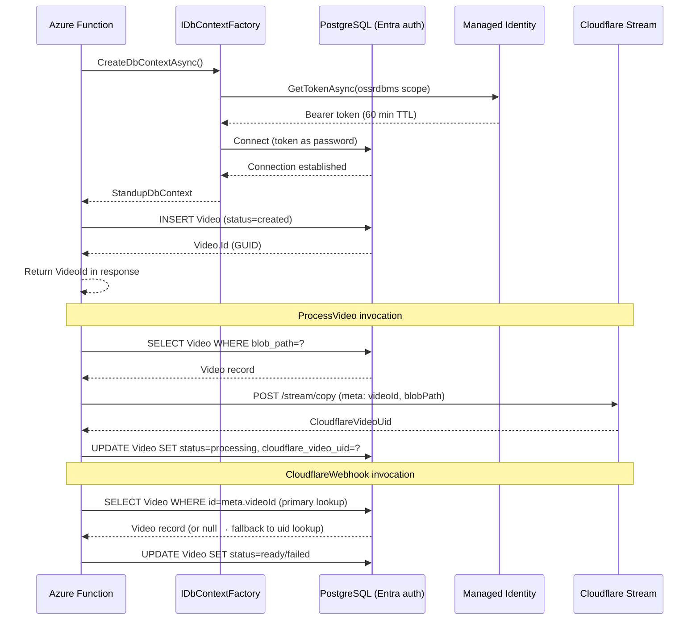

# ADR-004: Use Azure Database for PostgreSQL Flexible Server for Video Persistence

**Date**: 2026-03-24
**Status**: Proposed
**Author**: Michael F. Collins, III

---

## Context

Naked Standup needs a relational database to persist video lifecycle state across its Azure Functions
pipeline. Each video progresses through a series of states — created, processing, ready, and failed
— driven by three decoupled functions: `CreateVideo`, `ProcessVideo`, and `CloudflareWebhook`. When
a user submits a video, the system must:

1. Record the video's identity and blob storage path
2. Track status changes as the video moves through transcoding
3. Persist Cloudflare playback URLs and metadata once transcoding completes
4. Support future multi-user queries (list videos by owner, filter by status)

The project's longer-term roadmap includes backend services written in Go (GORM), Rust (sea-orm),
and Elixir/Phoenix (Ecto). This polyglot constraint placed a hard requirement on the database choice:
all three ecosystems must have mature drivers and ORM support.

---

## Decision

Use **Azure Database for PostgreSQL Flexible Server** with **Entity Framework Core 10** and the
**Npgsql.EntityFrameworkCore.PostgreSQL 10.0.1** provider.

### Database Configuration

- **SKU**: `Standard_B1ms` (Burstable, 1 vCPU, 2 GiB RAM)
- **Storage**: 32 GiB
- **PostgreSQL version**: 17
- **API version**: `Microsoft.DBforPostgreSQL/flexibleServers@2024-08-01`
- **Authentication**: Entra ID only — password authentication disabled

### Authentication Strategy

The Function App uses its **system-assigned managed identity** to authenticate with PostgreSQL.
No password is stored anywhere. The `DefaultAzureCredential` acquires an OAuth2 bearer token
targeting `https://ossrdbms-aad.database.windows.net/.default`. This token is passed as the
connection password via Npgsql's `UsePeriodicPasswordProvider`, which refreshes every 55 minutes
(tokens expire at 60 minutes).

```csharp
var credential = new DefaultAzureCredential();
var dataSourceBuilder = new NpgsqlDataSourceBuilder(connectionString);
dataSourceBuilder.UsePeriodicPasswordProvider(
    async (_, ct) =>
    {
        var tokenRequest = new TokenRequestContext(
            new[] { "https://ossrdbms-aad.database.windows.net/.default" });
        var token = await credential.GetTokenAsync(tokenRequest, ct);
        return token.Token;
    },
    TimeSpan.FromMinutes(55),
    TimeSpan.Zero);
var dataSource = dataSourceBuilder.Build();
```

### DbContext Registration

Because `UsePeriodicPasswordProvider` is incompatible with `AddDbContextPoolFactory` (connection
pooling caches connections with embedded credentials), the project uses `IDbContextFactory<T>`
with `AddDbContextFactory`:

```csharp
services.AddDbContextFactory<StandupDbContext>(options =>
    options.UseNpgsql(dataSource));
```

Each function invocation creates and disposes its own `StandupDbContext` instance via
`await factory.CreateDbContextAsync(ct)`.

### ORM Configuration

Column names are mapped explicitly using the fluent API `.HasColumnName("snake_case")` rather than
relying on the `EFCore.NamingConventions` package. This avoids an extra dependency and keeps the
mapping visible in `OnModelCreating`.

### Unit Testing Approach

Production code uses `IDbContextFactory<StandupDbContext>`. In unit tests, the factory mock returns
a `StandupDbContext` backed by SQLite in-memory. The EF Core InMemory provider is explicitly
avoided (Microsoft discourages it due to behavioral differences with real databases). The SQLite
connection is opened before `EnsureCreated()` and held open for the lifetime of the test.

```csharp
var options = new DbContextOptionsBuilder<StandupDbContext>()
    .UseSqlite("DataSource=:memory:")
    .Options;
var context = new StandupDbContext(options);
context.Database.OpenConnection();
context.Database.EnsureCreated();
```

---

## Alternatives Considered

### Azure Cosmos DB (NoSQL)

**Rejected**: High cost for the query patterns required (multi-dimensional filtering by user and
status). No relational semantics; poor fit for the lifecycle state machine.

### Azure Cosmos DB (MongoDB vCore)

**Rejected**: More complex than necessary for the current data model. MongoDB vCore adds operational
overhead (replica set, no tier-free SQL-compatible querying) without corresponding benefit.

### Azure SQL Database (Free Tier)

**Rejected**: No Elixir/Ecto adapter, no sea-orm (Rust) support. Eliminates the polyglot option at
a critical architectural juncture.

### Dapper with Raw Npgsql

**Rejected**: No migration tooling, manual SQL, higher maintenance burden. EF Core provides more
value for simple CRUD with migrations.

---

## Consequences

### Positive

- **Polyglot-ready**: Go (GORM), Rust (sea-orm), and Elixir/Phoenix (Ecto) all have mature
  PostgreSQL support. The database is a stable integration point for future service decomposition.
- **No passwords**: Entra-only auth aligns with the "Security by Default" constitution. No
  secret rotation required.
- **Standard tooling**: EF Core migrations, `dotnet ef` CLI, and standard .NET DI patterns keep
  the development experience familiar.
- **Cost-effective**: The Burstable `B1ms` SKU is appropriate for early-stage workloads.

### Negative / Trade-offs

- **Cold-start latency**: EF Core model building adds ~200–500ms and TLS handshake adds ~100–300ms
  on first invocation. Acceptable at current scale; monitor as traffic grows.
- **Migration coordination**: Running migrations requires a one-time manual step or a future CI/CD
  pipeline addition. Migration bundles are deferred.
- **Connection pool incompatibility**: `AddDbContextPoolFactory` cannot be used with the periodic
  password provider. Each invocation creates a new context. Acceptable for Azure Functions serverless
  workloads.

---

## Architecture Diagram



---

## References

- [Npgsql Entity Framework Core Provider](https://www.npgsql.org/efcore/)
- [Npgsql UsePeriodicPasswordProvider](https://www.npgsql.org/doc/security.html#password-callbacks)
- [EF Core DbContextFactory in Dependency Injection](https://learn.microsoft.com/en-us/ef/core/dbcontext-configuration/#using-a-dbcontext-factory)
- [Azure Database for PostgreSQL Flexible Server — Entra Auth](https://learn.microsoft.com/en-us/azure/postgresql/flexible-server/concepts-azure-ad-authentication)
- [ADR-002: Video Upload Architecture](002-video-upload-architecture.md)
- [ADR-003: Application Insights Monitoring](003-application-insights-monitoring.md)
