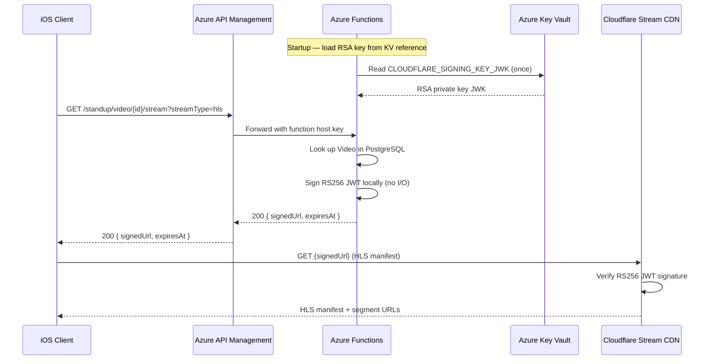

# ADR 005: Cloudflare Stream Signed URL Token Generation

**Status**: Proposed

**Date**: 2026-03-27

## Context

Feature 006 (Signed Video URLs) requires that the Naked Standup API return signed Cloudflare Stream manifest URLs when a client requests playback of a transcoded video. Cloudflare Stream supports two approaches for generating signed tokens:

1. **Cloudflare `/token` API** — The server calls `https://api.cloudflare.com/client/v4/accounts/{accountId}/stream/{videoId}/token`, passing a `pem` or `id` parameter to identify the signing key. Cloudflare generates and returns the signed JWT.

2. **Local RS256 JWT signing** — The server holds the Cloudflare-issued private signing key and generates the RS256 JWT locally using standard JWT libraries, then constructs the manifest URL.

The Cloudflare Stream documentation describes both flows and notes the `/token` API approach as the simpler getting-started path for customers who prefer to avoid managing key material on their servers.

## Decision

We will use **local RS256 JWT signing** (option 2). The `SignedUrlTokenService` reads the RS256 private key from the `CLOUDFLARE_SIGNING_KEY_JWK` application setting, creates a JWT with the required claims (`sub`, `kid`, `exp`), signs it using `System.IdentityModel.Tokens.Jwt`, and constructs the signed manifest URL locally without making an outbound HTTP call during request handling.

## Rationale

### Performance

The `/token` API approach introduces a synchronous outbound HTTP dependency on `api.cloudflare.com` during every playback request. Local signing eliminates this dependency entirely. Token generation becomes a CPU-only operation that completes in under a millisecond.

### Reliability

Any network partition, Cloudflare API outage, or rate-limit event affecting `api.cloudflare.com` would propagate directly into playback failures for users. Local signing decouples playback URL generation from Cloudflare API availability.

### Cold-Start Cost

The Naked Standup API runs on Azure Functions Flex Consumption, which supports scale-to-zero. An outbound HTTP call to Cloudflare on a cold-start path adds latency during token creation. Loading the RSA key once at startup (`SignedUrlTokenService` constructor) means subsequent calls bear no I/O cost.

### Simplicity

The Cloudflare token API would require an `ICloudflareTokenService` interface, HTTP client registration, and retry/error-handling logic. Local signing requires only the `System.IdentityModel.Tokens.Jwt` NuGet package and standard .NET cryptography APIs.

### Security Considerations

Local signing requires storing the RSA private key as an application secret. The private key is stored in Azure Key Vault (`CloudflareSigningKeyJwk` secret), loaded into the Function App via a Key Vault reference app setting, and never written to application logs. If a signing key is compromised, it must be rotated in both Cloudflare Stream and Key Vault; Cloudflare supports up to 1,000 signing keys per account, allowing zero-downtime rotation by issuing a new key before revoking the old one.

## Token Structure

The generated JWT uses the following claims:

| Claim | Value | Purpose |
|-------|-------|---------|
| `sub` | Cloudflare video UID | Identifies which video the token authorises |
| `kid` | Cloudflare signing key ID | Tells Cloudflare which public key to use for verification |
| `exp` | UTC Unix timestamp, now + 1 hour | Token expiration — Cloudflare rejects requests with expired tokens |
| `alg` | `RS256` | Signing algorithm |

The signed token is embedded in the manifest URL path:

```
https://customer-{customerCode}.cloudflarestream.com/{token}/manifest/video.m3u8
https://customer-{customerCode}.cloudflarestream.com/{token}/manifest/video.mpd
```

## Implementation

```csharp
// SignedUrlTokenService — key loading at startup
using var rsa = RSA.Create();
rsa.ImportParameters(ParseRsaParametersFromJwk(signingKeyJwk));
var rsaSecurityKey = new RsaSecurityKey(rsa) { KeyId = signingKeyId };
_signingCredentials = new SigningCredentials(rsaSecurityKey, SecurityAlgorithms.RsaSha256);

// Token generation per request
var tokenDescriptor = new SecurityTokenDescriptor
{
    Claims = new Dictionary<string, object>
    {
        ["sub"] = cloudflareVideoUid,
        ["kid"] = _signingKeyId
    },
    Expires = expiresAt.UtcDateTime,
    SigningCredentials = _signingCredentials
};
var tokenHandler = new JwtSecurityTokenHandler();
var token = tokenHandler.CreateToken(tokenDescriptor);
var tokenString = tokenHandler.WriteToken(token);
```

## Diagram



## Alternatives Considered

### Cloudflare `/token` API

Rejected due to the performance and reliability concerns described above. The added per-request outbound HTTP call is a poor trade-off given that local signing produces the same signed token without any network dependency.

### Short-Lived SAS URL for Stream Access

Cloudflare Stream does not support Azure Blob Storage SAS URL playback — the signed URL mechanism is Cloudflare-specific and requires their JWT format.

## Consequences

- The RSA private signing key must be provisioned in Cloudflare Stream and stored in Azure Key Vault before the `GetSignedStreamUrl` function can return valid playback URLs.
- Key rotation requires generating a new key pair in Cloudflare, updating the Key Vault secret, and restarting the Function App to reload the key at startup.
- The `CLOUDFLARE_SIGNING_KEY_JWK` secret must **never** appear in application logs. The `SignedUrlTokenService` constructor validates this setting is present but does not log its value.
- All newly uploaded videos are automatically locked (`requireSignedURLs: true`) when submitted for transcoding, so all playback must go through this token-generation path.
