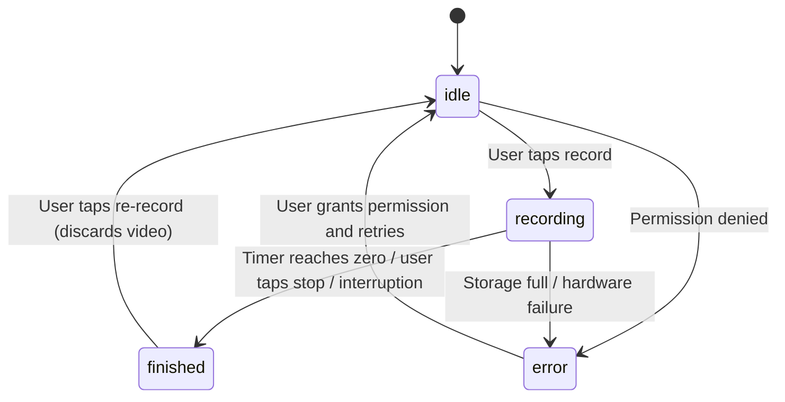
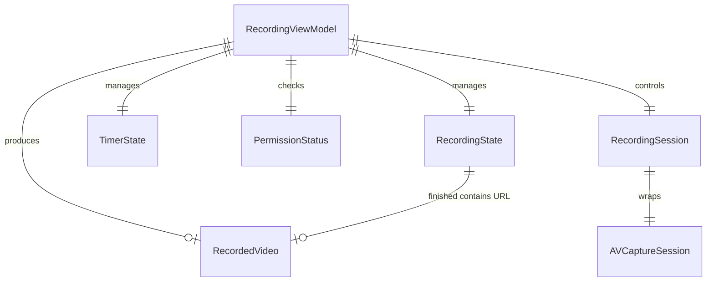

# Data Model: Record Status Report Video

**Feature**: 001-record-status-video
**Date**: 2026-03-22

## Entities

### 1. RecordingState

Represents the current state of the recording flow, driven by the `RecordingViewModel`.

```swift
enum RecordingState {
    case idle              // Camera preview visible, ready to record
    case recording         // Actively capturing video
    case finished(URL)     // Recording complete, video file available at URL
    case error(String)     // An error occurred (permission denied, storage full, etc.)
}
```

**State Transitions**:



**Validation Rules**:
- `idle` → `recording` requires both camera and microphone permissions to be `.authorized`
- `recording` → `finished` always produces a valid `URL` pointing to a `.mov` file in `tmp/`
- `finished` → `idle` must delete the file at the associated URL before transitioning

---

### 2. TimerState

Represents the countdown timer's current value and urgency level.

```swift
struct TimerState {
    let totalDuration: TimeInterval     // Always 30.0
    var remainingTime: TimeInterval     // Counts down from 30.0 to 0.0
    
    var urgency: TimerUrgency {
        switch remainingTime {
        case ...5:
            return .critical   // Red
        case ...10:
            return .warning    // Yellow
        default:
            return .normal     // Default color
        }
    }
    
    var progress: Double {
        remainingTime / totalDuration   // 1.0 → 0.0
    }
}

enum TimerUrgency {
    case normal     // > 10 seconds remaining
    case warning    // 5 < remaining <= 10
    case critical   // remaining <= 5
}
```

**Validation Rules**:
- `totalDuration` is always `30.0` (FR-007)
- `remainingTime` is clamped to `0.0...totalDuration`
- `urgency` transitions at exactly 10s (FR-005) and 5s (FR-006) thresholds
- `progress` is `1.0` at start, `0.0` at end

---

### 3. RecordedVideo

Represents a captured video file on the device.

```swift
struct RecordedVideo {
    let fileURL: URL            // Location in tmp/ directory
    let duration: TimeInterval  // Actual recording duration (0 < duration <= 30)
    let createdAt: Date         // When recording completed
}
```

**Validation Rules**:
- `fileURL` must point to a file in `FileManager.default.temporaryDirectory`
- `fileURL` must have `.mov` path extension
- `duration` must be > 0 and <= 30 seconds
- File at `fileURL` must exist when this struct is created

**Lifecycle**:
- Created when `RecordingState` transitions to `.finished`
- Deleted when user taps re-record or navigates away
- Not persisted across app launches (temp directory is volatile)

---

### 4. PermissionStatus

Tracks camera and microphone authorization state.

```swift
struct PermissionStatus {
    var camera: AVAuthorizationStatus
    var microphone: AVAuthorizationStatus
    
    var isFullyAuthorized: Bool {
        camera == .authorized && microphone == .authorized
    }
    
    var needsRequest: Bool {
        camera == .notDetermined || microphone == .notDetermined
    }
}
```

**Validation Rules**:
- Both `camera` and `microphone` must be `.authorized` before recording can begin (FR-013)
- If either is `.denied` or `.restricted`, UI must show guidance to Settings

## Entity Relationships



- A `RecordingViewModel` manages exactly one `RecordingState`, one `TimerState`, and one `PermissionStatus`
- A `RecordingViewModel` controls exactly one `RecordingSession` (the AVFoundation capture lifecycle)
- A `RecordingState.finished` produces exactly one `RecordedVideo`
- When re-recording, the previous `RecordedVideo` is deleted and a new one is created

## View-to-Model Mapping

| SwiftUI View | Reads from ViewModel | Actions |
|---|---|---|
| `RecordingScreen` | `recordingState`, `timerState`, `permissionStatus` | `startRecording()`, `stopRecording()` |
| `CameraPreview` | capture session (via `RecordingSession`) | — (display only) |
| `CountdownTimerView` | `timerState` | — (display only) |
| `ReviewScreen` | `RecordedVideo` (from `recordingState.finished`) | `reRecord()`, `playVideo()` |
| `VideoPlayerView` | `RecordedVideo.fileURL` | — (playback controls) |
