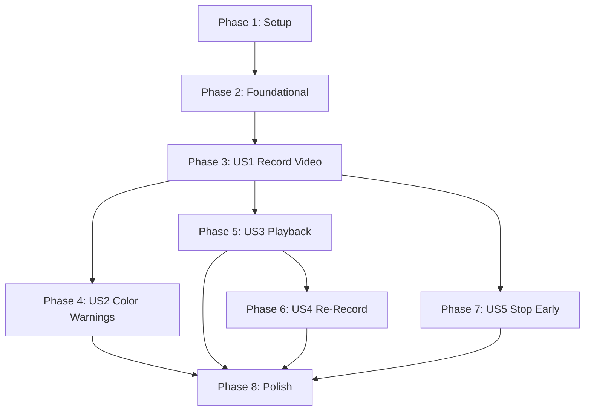

# Tasks: Record Status Report Video

**Feature**: 001-record-status-video
**Generated**: 2026-03-22
**Spec**: [spec.md](spec.md) | **Plan**: [plan.md](plan.md)

---

## Phase 1: Setup

> Project configuration required before any feature code can be written.

- [x] T001 Add `NSCameraUsageDescription` and `NSMicrophoneUsageDescription` to infoPlist in `Apple/Projects/Standup/Project.swift`
- [x] T002 Add `StandupTests` unit test target with dependency on Standup in `Apple/Projects/Standup/Project.swift`

---

## Phase 2: Foundational

> Blocking prerequisites for all user stories. These are the AVFoundation and UIKit bridge components that every story depends on.

- [x] T003 [P] Implement RecordingSession AVCaptureSession lifecycle wrapper in `Apple/Projects/Standup/Sources/Recording/RecordingSession.swift`
- [x] T004 [P] Implement CameraPreview UIViewRepresentable for AVCaptureVideoPreviewLayer in `Apple/Projects/Standup/Sources/Recording/CameraPreview.swift`

### T003 Details — RecordingSession

Create `RecordingSession` as an `NSObject` subclass conforming to `AVCaptureFileOutputRecordingDelegate`. It must:
- Configure `AVCaptureSession` with `.high` session preset
- Add front camera input (`AVCaptureDevice.default(.builtInWideAngleCamera, for: .video, position: .front)`)
- Add microphone input (`AVCaptureDevice.default(for: .audio)`)
- Add `AVCaptureMovieFileOutput` as output
- Manage session on a dedicated serial `DispatchQueue(label: "dev.michaelfcollins3.standup.capture")`
- Provide `startSession()` / `stopSession()` for preview lifecycle
- Provide `startRecording(to:)` / `stopRecording()` for capture
- Generate output URLs via `FileManager.default.temporaryDirectory.appendingPathComponent(UUID().uuidString).appendingPathExtension("mov")`
- Implement `fileOutput(_:didFinishRecordingTo:from:error:)` delegate callback
- Expose the `AVCaptureSession` for `CameraPreview` to connect to

### T004 Details — CameraPreview

Create a `UIView` subclass with `override class var layerClass: AnyClass { AVCaptureVideoPreviewLayer.self }` and wrap it in a `UIViewRepresentable`. Set `videoGravity = .resizeAspectFill`. Accept an `AVCaptureSession` parameter and connect via `previewLayer.session = captureSession`.

---

## Phase 3: US1 — Record a 30-Second Status Video (P1)

> **Story Goal**: Users can open the recording screen, see a live camera preview, tap record, watch a countdown timer count from 30 to 0, and have recording stop automatically.
>
> **Independent Test**: Open recording screen → tap record → wait 30 seconds → verify recording stops and a `.mov` file exists in temp directory.

- [x] T005 [US1] Implement model types (RecordingState, TimerState, TimerUrgency, RecordedVideo, PermissionStatus) in `Apple/Projects/Standup/Sources/Recording/RecordingViewModel.swift`
- [x] T006 [US1] Write RecordingViewModelTests for recording start, timer countdown, and auto-stop at zero in `Apple/Projects/StandupTests/Sources/Recording/RecordingViewModelTests.swift`
- [x] T007 [US1] Implement RecordingViewModel with state management, permission checking, and countdown timer in `Apple/Projects/Standup/Sources/Recording/RecordingViewModel.swift`
- [x] T008 [US1] Implement CountdownTimerView with circular progress gauge and remaining time display in `Apple/Projects/Standup/Sources/Recording/CountdownTimerView.swift`
- [x] T009 [US1] Implement RecordingScreen with camera preview, record button, and timer overlay in `Apple/Projects/Standup/Sources/Recording/RecordingScreen.swift`
- [x] T010 [US1] Add navigation from MainView to RecordingScreen in `Apple/Projects/Standup/Sources/MainView.swift`

### T005 Details — Model Types

Define the following types as documented in [data-model.md](data-model.md):
- `RecordingState` enum: `.idle`, `.recording`, `.finished(URL)`, `.error(String)`
- `TimerState` struct: `totalDuration`, `remainingTime`, computed `urgency` and `progress`
- `TimerUrgency` enum: `.normal`, `.warning`, `.critical`
- `RecordedVideo` struct: `fileURL`, `duration`, `createdAt`
- `PermissionStatus` struct: `camera`, `microphone` (both `AVAuthorizationStatus`), computed `isFullyAuthorized` and `needsRequest`

These are stub type definitions to enable TDD — tests (T006) will be written against these types before the ViewModel logic is implemented (T007).

### T006 Details — RecordingViewModelTests

Write tests using Swift Testing (`import Testing`):
- Test that `startRecording()` transitions state from `.idle` to `.recording`
- Test that `startRecording()` requires `isFullyAuthorized` permissions
- Test that timer starts at 30.0 and counts down
- Test that recording auto-stops when timer reaches 0 (state → `.finished`)
- Test that `TimerState.urgency` returns `.normal` when > 10s, `.warning` at 10s, `.critical` at 5s
- Test `TimerState.progress` calculation (1.0 → 0.0)

Use a protocol for `RecordingSession` to inject a mock in tests.

### T007 Details — RecordingViewModel

Implement as `@Observable` class:
- Manage `recordingState`, `timerState`, `permissionStatus`
- `checkPermissions()` — query `AVCaptureDevice.authorizationStatus(for:)` for both `.video` and `.audio`; request if `.notDetermined`
- `startRecording()` — verify permissions, start capture session recording, start a `Timer` that decrements `remainingTime` every 1 second
- Auto-stop when `remainingTime` reaches 0
- Hold a reference to `RecordingSession` (inject via init for testability)

### T008 Details — CountdownTimerView

Create a SwiftUI view that reads `TimerState` and displays:
- A circular progress gauge (`progress` from 1.0 → 0.0)
- Remaining time as centered text (e.g., "25")
- Default system tint color (color coding added in US2 phase)
- Support Dynamic Type for the time label

### T009 Details — RecordingScreen

Compose the recording UI:
- Full-screen `CameraPreview` as background
- `CountdownTimerView` overlay
- Prominent record button (starts recording)
- Permission status check on appear via `RecordingViewModel.checkPermissions()`

### T010 Details — MainView Navigation

Replace the placeholder "Hello, World!" with navigation to `RecordingScreen`. Use `NavigationStack` or direct presentation as appropriate for the app's navigation pattern.

---

## Phase 4: US2 — See Color-Coded Time Warnings (P1)

> **Story Goal**: The countdown timer changes color to yellow at 10 seconds remaining and red at 5 seconds remaining, with accessible alternatives to color.
>
> **Independent Test**: Start recording → observe timer is default color → at 10s remaining, timer turns yellow → at 5s remaining, timer turns red. VoiceOver announces threshold changes.

- [x] T011 [US2] Write CountdownTimerTests for urgency color mapping and threshold transitions in `Apple/Projects/StandupTests/Sources/Recording/CountdownTimerTests.swift`
- [x] T012 [US2] Add color-coded urgency states to CountdownTimerView (default, yellow at 10s, red at 5s) in `Apple/Projects/Standup/Sources/Recording/CountdownTimerView.swift`
- [x] T013 [US2] Add VoiceOver accessibility announcements at 10s and 5s thresholds in `Apple/Projects/Standup/Sources/Recording/RecordingViewModel.swift`

### T011 Details — CountdownTimerTests

Write tests using Swift Testing (`import Testing`):
- Test that `TimerUrgency.normal` maps to the default system tint color
- Test that `TimerUrgency.warning` maps to yellow
- Test that `TimerUrgency.critical` maps to red
- Test color transition at exactly 10s boundary (normal → warning)
- Test color transition at exactly 5s boundary (warning → critical)

### T012 Details — Color-Coded CountdownTimerView

Enhance `CountdownTimerView` (created in T008) to:
- Apply gauge/text color based on `TimerState.urgency`: `.normal` → default tint, `.warning` → `.yellow`, `.critical` → `.red`
- Add a text label alongside the gauge showing urgency state (e.g., "Time running out") so urgency is not color-only (WCAG 1.4.1)
- Ensure minimum 4.5:1 contrast ratio for timer colors against background (WCAG 2.1 AA)
- Add `.accessibilityLabel` that includes both remaining time and urgency state

### T013 Details — Accessibility Announcements

In `RecordingViewModel`, post `AccessibilityNotification.Announcement` when:
- `remainingTime` crosses the 10-second threshold ("10 seconds remaining")
- `remainingTime` crosses the 5-second threshold ("5 seconds remaining, wrapping up")

---

## Phase 5: US3 — Preview and Play Back the Recorded Video (P1)

> **Story Goal**: After recording, the user sees a review screen with their video and can play it back locally.
>
> **Independent Test**: Record a video → review screen appears → tap play → video plays with audio from start to finish → playback ends and user remains on review screen.

- [x] T014 [P] [US3] Implement VideoPlayerView wrapping AVKit VideoPlayer for local file playback in `Apple/Projects/Standup/Sources/Recording/VideoPlayerView.swift`
- [x] T015 [US3] Implement ReviewScreen with video preview and play button in `Apple/Projects/Standup/Sources/Recording/ReviewScreen.swift`
- [x] T016 [US3] Add navigation from RecordingScreen to ReviewScreen on recording completion in `Apple/Projects/Standup/Sources/Recording/RecordingScreen.swift`

### T014 Details — VideoPlayerView

Create a SwiftUI view wrapping `VideoPlayer` from `AVKit`:
- Accept a local file `URL` parameter
- Create `AVPlayer(url:)` for the `.mov` file
- Initialize player in `.task` modifier (Apple recommended pattern)
- Built-in transport controls are sufficient (no custom controls needed)

### T015 Details — ReviewScreen

Create a SwiftUI view that:
- Displays the `VideoPlayerView` with the recorded video
- Shows the video duration
- Provides a clear layout for playback controls
- Placeholder for re-record button (implemented in US4, T019)

### T016 Details — Navigation to ReviewScreen

Update `RecordingScreen` to observe `RecordingViewModel.recordingState` and navigate to `ReviewScreen` when state transitions to `.finished(url)`. Pass the recorded video URL to `ReviewScreen`.

---

## Phase 6: US4 — Re-Record the Video (P2)

> **Story Goal**: The user can discard the current recording and return to the recording screen with a fresh 30-second timer.
>
> **Independent Test**: Record a video → review screen → tap re-record → recording screen appears with live preview and 30s timer → old video file no longer exists.

- [x] T017 [US4] Write tests for re-record state transition and temp file cleanup in `Apple/Projects/StandupTests/Sources/Recording/RecordingViewModelTests.swift`
- [x] T018 [US4] Implement reRecord() in RecordingViewModel with video file deletion and state reset in `Apple/Projects/Standup/Sources/Recording/RecordingViewModel.swift`
- [x] T019 [US4] Add re-record button with discard confirmation to ReviewScreen in `Apple/Projects/Standup/Sources/Recording/ReviewScreen.swift`

### T017 Details — Re-Record Tests

Write tests using Swift Testing:
- Test that `reRecord()` transitions state from `.finished` to `.idle`
- Test that `reRecord()` resets `timerState.remainingTime` to 30.0
- Test that `reRecord()` deletes the temporary video file (mock FileManager or verify URL no longer valid)
- Test that after re-record, a new recording produces a different file URL

### T018 Details — reRecord() Implementation

Add `reRecord()` to `RecordingViewModel`:
- Delete the video file at the `.finished` URL using `FileManager.default.removeItem(at:)`
- Reset `recordingState` to `.idle`
- Reset `timerState.remainingTime` to `totalDuration` (30.0)
- Restart camera preview session (call `RecordingSession.startSession()`)

### T019 Details — Re-Record Button

Add a "Re-record" button to `ReviewScreen`:
- Tapping calls `RecordingViewModel.reRecord()`
- Navigation returns to `RecordingScreen` with fresh state
- Ensure the user experience is identical to the first recording attempt (FR-011, acceptance scenario 3)

---

## Phase 7: US5 — Stop Recording Early (P2)

> **Story Goal**: The user can tap a stop button to end recording before 30 seconds, producing a shorter video.
>
> **Independent Test**: Start recording → tap stop at ~10 seconds → review screen shows video → play back → video is ~10 seconds long.

- [x] T020 [US5] Write tests for early stop producing partial video with correct duration in `Apple/Projects/StandupTests/Sources/Recording/RecordingViewModelTests.swift`
- [x] T021 [US5] Add stop button to RecordingScreen and wire to stopRecording() in `Apple/Projects/Standup/Sources/Recording/RecordingScreen.swift`

### T020 Details — Early Stop Tests

Write tests using Swift Testing:
- Test that `stopRecording()` transitions state from `.recording` to `.finished`
- Test that stopping early preserves the partial recording URL
- Test that timer stops counting down after `stopRecording()`
- Test that the `RecordedVideo.duration` reflects the actual recording time, not 30 seconds

### T021 Details — Stop Button

Add a stop button to `RecordingScreen`:
- Visible only when `recordingState == .recording`
- Replaces or supplements the record button during recording
- Tapping calls `RecordingViewModel.stopRecording()`
- Add `.accessibilityLabel("Stop recording")` and `.accessibilityHint("Stops recording and shows your video for review")`

---

## Phase 8: Polish & Cross-Cutting Concerns

> Final quality, accessibility, error handling, and documentation tasks.

- [x] T022 Implement permission denied UI with guidance to Settings in `Apple/Projects/Standup/Sources/Recording/RecordingScreen.swift`
- [x] T023 [P] Handle external app interruptions (incoming calls, backgrounding) by preserving partial video in `Apple/Projects/Standup/Sources/Recording/RecordingViewModel.swift`
- [x] T023b [P] Handle user-initiated navigation away from recording screen by discarding partial video in `Apple/Projects/Standup/Sources/Recording/RecordingViewModel.swift`
- [x] T024 [P] Handle storage full and recording error states in `Apple/Projects/Standup/Sources/Recording/RecordingViewModel.swift`
- [x] T025 [P] Add accessibility labels, hints, and Dynamic Type support to all interactive controls across recording and review screens
- [x] T026 [P] Create ADR for AVFoundation recording architecture in `docs/adrs/001-avfoundation-recording-architecture.md`

### T022 Details — Permission Denied UI

When `permissionStatus.camera` or `permissionStatus.microphone` is `.denied` or `.restricted`:
- Show a clear message explaining why camera and microphone access are needed (FR-013)
- Provide a button or link that opens the app's Settings page via `UIApplication.shared.open(URL(string: UIApplication.openSettingsURLString)!)`
- Hide the record button when permissions are not granted

### T023 Details — External App Interruptions

Observe `UIApplication.didEnterBackgroundNotification` and interruption events:
- Stop recording if in progress (FR-015)
- Preserve partial video for review
- Transition to `.finished` state with the partial recording
- When app returns to foreground, show review screen with partial video

### T023b Details — User-Initiated Navigation Away

Handle the case where the user navigates away from the recording screen while recording:
- Stop recording immediately
- Discard the partial video file (edge case: user navigated away voluntarily)
- Reset state to `.idle` so a fresh recording can begin if the user returns
- This is distinct from external interruptions (T023) where the partial video is preserved

### T024 Details — Error Handling

Handle `RecordingSession` delegate errors:
- If `AVCaptureFileOutput` reports an error (storage full, hardware failure), transition to `.error(message)`
- Display user-friendly error in `RecordingScreen` (edge case: storage full)
- Preserve partial video if available (edge case: storage full during recording)

### T025 Details — Accessibility Polish

Audit and add to all screens:
- `.accessibilityLabel` and `.accessibilityHint` on record button, stop button, re-record button, play button
- Timer: `.accessibilityValue` with remaining seconds and urgency text
- Review screen: `.accessibilityLabel` on video preview area
- Ensure all text labels support Dynamic Type (use system fonts, avoid fixed sizes)
- Verify 4.5:1 contrast ratios on timer colors (WCAG 2.1 AA)

### T026 Details — ADR

Document the AVFoundation architecture decision:
- Title: "Use AVCaptureSession with AVCaptureMovieFileOutput for Video Recording"
- Status: Proposed
- Context: Need to record 30-second video with audio on iOS
- Decision: AVCaptureSession + AVCaptureMovieFileOutput over AVAssetWriter
- Consequences: Simpler implementation, automatic muxing, limited encoding control (acceptable for 30s clips)
- Reference research.md sections 1, 2, 7

---

## Dependencies



### User Story Completion Order

| Order | Story | Depends On | Can Parallel With |
|-------|-------|------------|-------------------|
| 1 | US1 — Record Video | Setup + Foundational | — |
| 2 | US2 — Color Warnings | US1 | US3, US5 |
| 2 | US3 — Playback | US1 | US2, US5 |
| 2 | US5 — Stop Early | US1 | US2, US3 |
| 3 | US4 — Re-Record | US1 + US3 | — |
| 4 | Polish | All stories | — |

### Parallel Execution Opportunities

**After US1 completes**, three stories can run in parallel:

```
                  ┌─── US2 (Color Warnings): T011, T012, T013
                  │
US1 completed ────┼─── US3 (Playback): T014, T015, T016
                  │
                  └─── US5 (Stop Early): T020, T021
```

**Within Phase 2**, foundational tasks are parallel:
- T003 (RecordingSession) and T004 (CameraPreview) can be implemented simultaneously

**Within Phase 8**, polish tasks T023, T023b, T024, T025, T026 are all parallelizable.

---

## Implementation Strategy

### MVP Scope — US1 Only

The minimum viable increment is **Phase 1 + Phase 2 + Phase 3 (US1)**:
- User can open the recording screen, see camera preview, tap record, and watch a 30-second countdown
- Recording stops automatically and produces a `.mov` file
- **Tasks**: T001–T010 (10 tasks)
- Delivers: Working recording with timer, testable end-to-end on device

### MVP+ — Core Experience

Add **Phase 4 (US2) + Phase 5 (US3)** for the complete P1 experience:
- Color-coded timer warnings with accessibility
- Review screen with video playback
- **Additional tasks**: T011–T016 (6 tasks, total 16)

### Full Feature

Add **Phase 6 (US4) + Phase 7 (US5) + Phase 8 (Polish)**:
- Re-record capability, early stop, error handling, full accessibility
- **Additional tasks**: T017–T026 (10 tasks, total 26)
