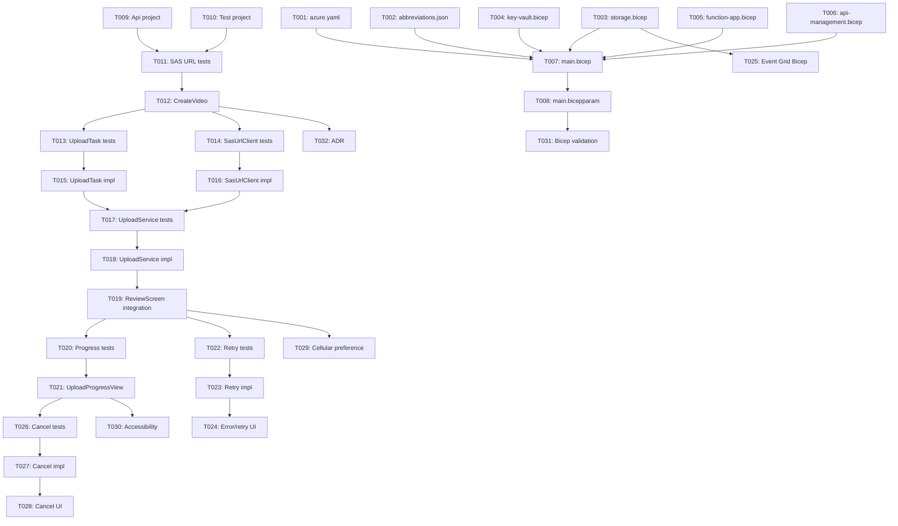

# Feature 002: Video Upload Processing

**Generated**: 2026-03-21
**Feature Spec**: [spec.md](spec.md)
**Implementation Plan**: [plan.md](plan.md)
**Data Model**: [data-model.md](data-model.md)
**API Contracts**: [contracts/standup-api.md](contracts/standup-api.md)
**Research**: [research.md](research.md)
**Quickstart**: [quickstart.md](quickstart.md)

---

## Phase 1: Setup

> Initialize the Azure Developer CLI project scaffolding and naming conventions
> required before any Azure infrastructure or backend work can begin.

- [x] T001 Create azd project manifest in `azure.yaml`
- [x] T002 [P] Create CAF naming abbreviations in `infra/abbreviations.json`

### T001 Details

Create `azure.yaml` at the repository root with the following structure:

- `name: standup`
- Define two services:
  - `api` — Azure Function host, language `dotnet`, project path `./api`, host `function`
  - `web` — (placeholder for future frontend deployment)
- Reference `infra/main.bicep` as the infrastructure path

See R-001 in research.md for the `azure.yaml` schema and conventions.

### T002 Details

Create `infra/abbreviations.json` with Cloud Adoption Framework abbreviation
mappings for all resource types used by this feature:

- `storage-account` → `st`
- `function-app` → `func`
- `app-service-plan` → `plan`
- `api-management` → `apim`
- `key-vault` → `kv`
- `resource-group` → `rg`
- `event-grid-system-topic` → `evgt`
- `event-grid-subscription` → `evgs`

---

## Phase 2: Foundational — Azure Infrastructure & Backend

> Provision all Azure resources and implement the SAS URL generation endpoint.
> These tasks MUST be completed before any iOS user story work can begin
> because the iOS client depends on a working SAS URL endpoint.

- [x] T003 [P] Create storage account Bicep module in `infra/modules/storage.bicep`
- [x] T004 [P] Create Key Vault Bicep module in `infra/modules/key-vault.bicep`
- [x] T005 [P] Create Function App Bicep module in `infra/modules/function-app.bicep`
- [x] T006 [P] Create API Management Bicep module in `infra/modules/api-management.bicep`
- [x] T007 Create main Bicep orchestrator in `infra/main.bicep`
- [x] T008 Create Bicep parameter file in `infra/main.bicepparam`
- [x] T009 [P] Scaffold Azure Functions .NET 10 project in `api/`
- [x] T010 [P] Scaffold xUnit test project in `api/Api.Tests/`
- [x] T011 Write tests for CreateVideo function in `api/Api.Tests/Functions/CreateVideoTests.cs`
- [x] T012 Implement CreateVideo function in `api/Functions/CreateVideo.cs`

### T003 Details

Create `infra/modules/storage.bicep` with the following resources:

- Storage account: Standard_LRS, Hot access tier
- Blob container: `status-videos` with private access
- Parameters: `name`, `location`, `tags`
- Outputs: `id`, `name`, `primaryEndpoints`

Apply least-privilege principle: no shared key access needed (SAS uses user
delegation keys via managed identity).

### T004 Details

Create `infra/modules/key-vault.bicep`:

- Key Vault with RBAC authorization (no access policies)
- Parameters: `name`, `location`, `tags`, `principalId` (for Function App identity)
- Store the Function App host key as a secret (for APIM → Function auth)
- Grant Key Vault Secrets User role to APIM identity
- Output: `id`, `name`, `vaultUri`

### T005 Details

Create `infra/modules/function-app.bicep`:

- Consumption plan (Y1/Dynamic SKU) with Linux
- Function App with .NET 10 isolated worker runtime
- System-assigned managed identity (enabled)
- RBAC role assignments on the storage account:
  - Storage Blob Delegator (for user delegation key)
  - Storage Blob Data Contributor (for blob operations)
- App settings: `AzureWebJobsStorage`, `FUNCTIONS_WORKER_RUNTIME` = `dotnet-isolated`,
  storage account connection string, `AZURE_STORAGE_BLOB_ENDPOINT`
- Parameters: `name`, `location`, `tags`, `storageAccountName`, `storageAccountId`
- Outputs: `id`, `name`, `principalId`, `defaultHostKey`

See R-002 and R-003 in research.md for RBAC and Consumption tier details.

### T006 Details

Create `infra/modules/api-management.bicep`:

- APIM Consumption tier instance
- API definition for Standup API:
  - Path prefix: `/standup`
  - Operation: `POST /video`
- Subscription required with custom header `X-Api-Key`
- Backend pointing to the Function App URL
- Inbound policy: set `x-functions-key` header from Key Vault named value
- Parameters: `name`, `location`, `tags`, `functionAppUrl`, `functionKey`,
  `publisherEmail`, `publisherName`
- Outputs: `id`, `gatewayUrl`

See R-003 in research.md for complete policy XML and Bicep resource structure.

### T007 Details

Create `infra/main.bicep` as the orchestration template:

- `targetScope = 'subscription'`
- Create resource group
- Generate `resourceToken` using `toLower(uniqueString(subscription().id, environmentName, location))`
- Load abbreviations from `abbreviations.json` using `loadJsonContent()`
- Reference all four modules (storage, key-vault, function-app, api-management)
- Wire outputs between modules (e.g., storage account name → Function App,
  Function App URL → APIM, Function host key → Key Vault)
- Tag all resources with `azd-env-name`
- Parameters: `environmentName`, `location`, `publisherEmail`

### T008 Details

Create `infra/main.bicepparam` using the native Bicep parameter file syntax:

```bicep
using './main.bicep'

param environmentName = readEnvironmentVariable('AZURE_ENV_NAME', '')
param location = readEnvironmentVariable('AZURE_LOCATION', 'eastus2')
param publisherEmail = readEnvironmentVariable('AZURE_PUBLISHER_EMAIL', '')
```

Use `readEnvironmentVariable()` so azd can inject values at provision time.

### T009 Details

Scaffold the `api/` directory with:

- `Api.csproj`: Target `net10.0`, `AzureFunctionsVersion` = `v4`,
  `OutputType` = `Exe`. NuGet packages:
  - `Microsoft.Azure.Functions.Worker`
  - `Microsoft.Azure.Functions.Worker.Sdk`
  - `Microsoft.Azure.Functions.Worker.Extensions.Http.AspNetCore`
  - `Azure.Storage.Blobs`
  - `Azure.Identity`
- `host.json`: Function runtime version 2, logging configuration
- `Program.cs`: Minimal hosting setup with
  `HostBuilder().ConfigureFunctionsWebApplication().Build().Run()`
- `local.settings.json`: Development settings with `UseDevelopmentStorage=true`
  (add to `.gitignore`)

### T010 Details

Scaffold `api/Api.Tests/`:

- `Api.Tests.csproj`: Target `net10.0`, reference `Api.csproj`.
  NuGet packages:
  - `xunit`
  - `xunit.runner.visualstudio`
  - `Microsoft.NET.Test.Sdk`
  - `Moq` or `NSubstitute` (for mocking Azure SDK clients)

### T011 Details

Write xUnit tests for the `CreateVideo` function BEFORE implementation (TDD):

- Test: valid request returns 200 with `uploadUrl`, `expiresAt`
- Test: unsupported `contentType` (not `video/mp4` or `video/quicktime`) returns 415
- Test: `fileSizeBytes` exceeding limit returns 400
- Test: returned `uploadUrl` contains a valid SAS token
- Test: blob path embedded in `uploadUrl` follows the pattern `uploads/{userId}/{uuid}.mp4`
- Test: `expiresAt` is within expected SAS duration window

Mock `BlobServiceClient` and `UserDelegationKey` to isolate the function logic.

### T012 Details

Implement `api/Functions/CreateVideo.cs`:

- HTTP trigger, `POST` method, `AuthorizationLevel.Function`
- Deserialize `SasUrlRequest` (contentType, fileSizeBytes)
- Validate: contentType must be `video/mp4` or `video/quicktime`,
  fileSizeBytes ≤ configured max
- Generate blob path: `uploads/{userId}/{Guid}.mp4`
- Use `BlobServiceClient` with `DefaultAzureCredential` for managed identity
- Get user delegation key via `GetUserDelegationKeyAsync`
- Build SAS with `BlobSasBuilder`: Write + Create permissions, 15-minute expiry
- Return `SasUrlResponse` JSON (uploadUrl, expiresAt)

See R-002 in research.md for the complete C# pattern.

---

## Phase 3: User Story 1 — Submit Approved Video for Upload

> **Story Goal**: As a team member, I want to submit my approved status video
> for upload so that my team can see my update.
>
> **Independent Test**: After Phase 3, tapping "Submit" on the review screen
> requests a SAS URL, creates an UploadTask, and initiates a background
> URLSession upload to Azure Blob Storage. The upload completes successfully
> when the backend is running.

- [x] T013 [P] [US1] Write tests for UploadTask model in `Apple/Projects/Standup/Tests/Upload/UploadTaskTests.swift`
- [x] T014 [P] [US1] Write tests for SasUrlClient in `Apple/Projects/Standup/Tests/Upload/SasUrlClientTests.swift`
- [x] T015 [US1] Implement UploadTask model in `Apple/Projects/Standup/Sources/Upload/UploadTask.swift`
- [x] T016 [US1] Implement SasUrlClient in `Apple/Projects/Standup/Sources/Upload/SasUrlClient.swift`
- [x] T017 [US1] Write tests for UploadService in `Apple/Projects/Standup/Tests/Upload/UploadServiceTests.swift`
- [x] T018 [US1] Implement UploadService in `Apple/Projects/Standup/Sources/Upload/UploadService.swift`
- [x] T019 [US1] Integrate upload trigger in `Apple/Projects/Standup/Sources/Recording/ReviewScreen.swift`

### T013 Details

Write Swift Testing tests for the `UploadTask` model (TDD):

- Test: initializing with a video file URL creates task in `.pending` status
- Test: all UploadStatus enum cases exist (pending, uploading, retrying,
  completed, failed, cancelled)
- Test: valid state transitions (pending → uploading, pending → cancelled,
  uploading → completed, uploading → retrying, uploading → cancelled,
  retrying → uploading, retrying → failed, retrying → cancelled,
  failed → pending)
- Test: invalid state transitions throw or return false
  (e.g., pending → completed, completed → uploading)
- Test: `progress` defaults to 0.0 and accepts values 0.0–1.0
- Test: `retryCount` increments on state transition to retrying

### T014 Details

Write Swift Testing tests for `SasUrlClient` (TDD):

- Test: successful POST to `/video` returns decoded `SasUrlResponse`
- Test: 400 response throws a descriptive error
- Test: 415 response (unsupported media type) throws appropriate error
- Test: 401 response (invalid API key) throws authentication error
- Test: network failure throws a connection error
- Test: request includes `X-Api-Key` header
- Test: request body encodes `SasUrlRequest` correctly (contentType,
  fileSizeBytes)

Use `URLProtocol` subclass to mock network responses in tests.

### T015 Details

Implement `UploadTask` as an `@Observable` class in Swift:

- Properties: `id` (UUID), `videoFileURL` (URL), `status` (UploadStatus),
  `progress` (Double), `sasURL` (URL?), `sasExpiresAt` (Date?),
  `retryCount` (Int), `errorMessage` (String?),
  `createdAt` (Date), `urlSessionTaskIdentifier` (Int?)
- `UploadStatus` enum: pending, uploading, retrying, completed, failed,
  cancelled
- State machine: validate transitions, throw on invalid transitions
- Conform to `Identifiable`

See data-model.md for the complete entity definition and state diagram.

### T016 Details

Implement `SasUrlClient`:

- Accept base URL and API key via initializer (dependency injection)
- Method: `func fetchSasUrl(for request: SasUrlRequest) async throws -> SasUrlResponse`
- POST to `{baseURL}/video`
- Set headers: `Content-Type: application/json`, `X-Api-Key: {apiKey}`
- Decode response as `SasUrlResponse` (uploadUrl, expiresAt)
- Throw typed errors for HTTP status codes (400, 401, 415, 500)
- `SasUrlRequest` and `SasUrlResponse` as `Codable` structs

See contracts/standup-api.md for request/response schemas.

### T017 Details

Write Swift Testing tests for `UploadService` (TDD):

- Test: `submit(videoAt:)` fetches SAS URL and transitions task to uploading
- Test: `submit(videoAt:)` creates a URLSession background upload task
- Test: upload task is configured with correct HTTP method (PUT),
  `x-ms-blob-type: BlockBlob` header, and `Content-Type: video/mp4`
- Test: URLSession uses `background(withIdentifier:)` configuration
- Test: `isDiscretionary` is set to `false` on the session config
- Test: delegate receives `didSendBodyData` callbacks for progress
- Test: successful upload transitions task to `.completed`
- Test: multiple concurrent uploads are tracked independently

Use a protocol abstraction for `URLSession` to enable mocking.

### T018 Details

Implement `UploadService` as an `@Observable` class:

- Property: `uploadTasks: [UploadTask]` (published for UI binding)
- Method: `func submit(videoAt url: URL) async throws`
  1. Create `UploadTask` in `.pending` state, append to `uploadTasks`
  2. Call `SasUrlClient.fetchSasUrl(for:)` to get upload URL
  3. Store SAS URL and expiry on the task
  4. Create background `URLSession` with `background(withIdentifier:)`
  5. Create `uploadTask(with:fromFile:)` — PUT request to SAS URL
  6. Set headers: `x-ms-blob-type: BlockBlob`, `Content-Type: video/mp4`,
     `Content-Length`
  7. Transition task to `.uploading`
- Implement `URLSessionTaskDelegate` methods:
  - `urlSession(_:task:didSendBodyData:)` → update `progress`
  - `urlSession(_:task:didCompleteWithError:)` → transition to
    `.completed` or handle error
- Handle `application(_:handleEventsForBackgroundURLSession:)` reconnection

See R-004 in research.md for URLSession background transfer patterns.

### T019 Details

Modify `ReviewScreen.swift` to add a "Submit" action:

- Add dependency on `UploadService` (via environment or initializer)
- When user taps "Submit", call `uploadService.submit(videoAt: videoURL)`
- Navigate away from the review screen after submission
- Handle errors by displaying an alert with the error message

---

## Phase 4: User Story 2 — See Upload Progress

> **Story Goal**: As a team member, I want to see the progress of my video
> upload so that I know if it's still working.
>
> **Independent Test**: After Phase 4, the UploadProgressView shows a
> progress bar that updates in real time as the background upload sends
> data. The upload percentage is displayed alongside the progress bar.

- [x] T020 [US2] Write tests for progress observation in `Apple/Projects/Standup/Tests/Upload/UploadServiceTests.swift`
- [x] T021 [US2] Create UploadProgressView in `Apple/Projects/Standup/Sources/Upload/UploadProgressView.swift`

### T020 Details

Extend UploadService tests for progress tracking (TDD):

- Test: `uploadTasks` array is observable and triggers view updates
- Test: progress updates from URLSession delegate propagate to UploadTask
- Test: progress value is clamped between 0.0 and 1.0
- Test: completed upload shows progress as 1.0
- Test: multiple uploads track independent progress values

### T021 Details

Create `UploadProgressView` as a SwiftUI view:

- Display a list of active upload tasks from `UploadService.uploadTasks`
- Each row shows:
  - Video thumbnail or file name
  - `ProgressView` with current progress value (0.0–1.0)
  - Percentage text (e.g., "67%")
  - Upload status label (uploading, completed, failed, etc.)
- Filter to show only non-completed uploads by default
- Add navigation from MainView or appropriate entry point

---

## Phase 5: User Story 3 — Recover from Upload Failure

> **Story Goal**: As a team member, I want failed uploads to automatically
> retry so that temporary network issues don't prevent my update from
> being shared.
>
> **Independent Test**: After Phase 5, a simulated network failure during
> upload transitions the task to retrying, and the upload automatically
> retries up to 3 times with exponential backoff. After max retries, the
> task shows as failed with a manual "Retry" button.

- [x] T022 [US3] Write tests for retry logic in `Apple/Projects/Standup/Tests/Upload/UploadServiceTests.swift`
- [x] T023 [US3] Implement retry and error recovery in `Apple/Projects/Standup/Sources/Upload/UploadService.swift`
- [x] T024 [US3] Add error state and retry UI to `Apple/Projects/Standup/Sources/Upload/UploadProgressView.swift`

### T022 Details

Write tests for retry and failure recovery (TDD):

- Test: network error transitions task from uploading → retrying
- Test: retrying state triggers automatic retry after delay
- Test: retry uses exponential backoff (2s, 4s, 8s)
- Test: `retryCount` increments with each retry attempt
- Test: exceeding max retries (3) transitions to `.failed`
- Test: failed task can be manually retried (failed → pending → uploading)
- Test: SAS URL expiration triggers re-fetch before retry
- Test: `sasExpiresAt` is checked before each retry attempt

### T023 Details

Extend `UploadService` with retry logic:

- On upload error in `didCompleteWithError`:
  1. Check if retryCount < maxRetries (3)
  2. If yes: transition to `.retrying`, schedule retry with exponential backoff
  3. If no: transition to `.failed`, set `errorMessage`
- Before each retry:
  - Check if `sasExpiresAt` has passed; if so, re-fetch SAS URL
  - Create new background upload task with the refreshed (or existing) SAS URL
- Add `func retry(task: UploadTask) async throws` for manual retry:
  - Reset task to `.pending`, clear error, re-fetch SAS URL, start upload
- Handle transient vs. permanent errors:
  - Transient (timeout, network loss): auto-retry
  - Permanent (4xx from blob storage): fail immediately

### T024 Details

Update `UploadProgressView` for error states:

- Failed uploads show:
  - Error icon and `errorMessage` text
  - "Retry" button that calls `uploadService.retry(task:)`
- Retrying uploads show:
  - "Retrying..." label with attempt count (e.g., "Retry 2 of 3")
  - Progress bar in indeterminate state during SAS re-fetch

---

## Phase 6: User Story 4 — Server Initiates Processing After Upload

> **Story Goal**: As a system, when a video upload completes, processing
> should be triggered automatically so that the video is ready for
> playback as soon as possible.
>
> **Independent Test**: After Phase 6, uploading a blob to the
> `status-videos` container fires an Event Grid event to the configured
> subscription endpoint. Verify with `az eventgrid` CLI or Azure Portal.

- [x] T025 [US4] Add Event Grid system topic and subscription in `infra/modules/storage.bicep`

### T025 Details

Extend `infra/modules/storage.bicep` to add:

- `Microsoft.EventGrid/systemTopics` resource:
  - Source: the storage account
  - Topic type: `Microsoft.Storage.StorageAccounts`
- `Microsoft.EventGrid/systemTopics/eventSubscriptions` resource:
  - Filter: `subjectBeginsWith` = `/blobServices/default/containers/status-videos/blobs/uploads/`
  - Event type: `Microsoft.Storage.BlobCreated`
  - Endpoint: placeholder webhook URL (to be replaced with actual processing
    function in a future feature)
  - Delivery with retry policy: max 3 attempts, 30-second event TTL

Note: The actual processing function is out of scope for this feature.
This task provisions the Event Grid infrastructure so it is ready when
the processing function is implemented.

---

## Phase 7: User Story 5 — Cancel In-Progress Upload

> **Story Goal**: As a team member, I want to cancel an in-progress upload
> so that I can re-record my video if I made a mistake.
>
> **Independent Test**: After Phase 7, tapping "Cancel" on an uploading
> task cancels the URLSession upload task, transitions the UploadTask to
> `.cancelled`, and removes it from the active uploads list.

- [x] T026 [US5] Write tests for cancel in `Apple/Projects/Standup/Tests/Upload/UploadServiceTests.swift`
- [x] T027 [US5] Implement cancel in `Apple/Projects/Standup/Sources/Upload/UploadService.swift`
- [x] T028 [US5] Add cancel UI to `Apple/Projects/Standup/Sources/Upload/UploadProgressView.swift`

### T026 Details

Write tests for cancellation (TDD):

- Test: `cancel(task:)` transitions task from uploading → cancelled
- Test: `cancel(task:)` calls `cancel()` on the URLSession upload task
- Test: cancelled task is removed from active uploads (or marked as cancelled)
- Test: cancelling a pending task (before upload starts) works
- Test: cancelling a retrying task works
- Test: cancelling an already completed task is a no-op
- Test: cancelling an already failed task is a no-op

### T027 Details

Add cancellation support to `UploadService`:

- Method: `func cancel(task: UploadTask)`
  1. Find the URLSession task by `urlSessionTaskIdentifier`
  2. Call `.cancel()` on the URLSession task
  3. Transition UploadTask to `.cancelled`
- Handle edge cases:
  - Task has no active URLSession task (pending state): just set cancelled
  - Task is in retrying state: cancel pending retry timer and set cancelled
- Clean up: optionally remove cancelled tasks from `uploadTasks` after
  a brief delay or on next app launch

### T028 Details

Update `UploadProgressView`:

- Add a "Cancel" button (or swipe-to-cancel gesture) on uploading and
  retrying tasks
- Tapping Cancel shows a confirmation alert: "Cancel this upload?"
- On confirm, call `uploadService.cancel(task:)`
- Cancelled tasks briefly show "Cancelled" state then fade out

---

## Phase 8: Polish & Cross-Cutting Concerns

> Final quality, accessibility, and validation tasks that span across
> multiple user stories.

- [x] T029 [P] Implement cellular upload preference in `Apple/Projects/Standup/Sources/Upload/UploadService.swift`
- [x] T030 [P] Add VoiceOver and Dynamic Type accessibility to `Apple/Projects/Standup/Sources/Upload/UploadProgressView.swift`
- [x] T031 [P] Validate Bicep templates with linter and what-if deployment
- [x] T032 [P] Create ADR for video upload architecture in `docs/adrs/002-video-upload-architecture.md`

### T029 Details

Implement the cellular upload preference from data-model.md:

- `CellularUploadPreference`: stored in `UserDefaults` (keys: `isSet`,
  `allowsCellular`)
- On first upload over cellular: prompt user with an alert
  - "Allow uploads over cellular data?"
  - Save choice to UserDefaults, set `isSet = true`
- Apply preference: set `allowsCellularAccess` on the URLSession
  configuration based on saved preference
- If cellular disallowed and on cellular: queue the upload and start when
  Wi-Fi is available (set `isDiscretionary = true` and
  `allowsCellularAccess = false`)

### T030 Details

Ensure UploadProgressView meets WCAG 2.1 AA standards:

- Add `accessibilityLabel` and `accessibilityValue` to all progress elements
  (e.g., "Upload progress: 67 percent")
- Support Dynamic Type: use `.font(.body)` and relative sizing
- Ensure "Retry" and "Cancel" buttons have minimum 44×44pt touch targets
- Test with VoiceOver: upload status changes should announce via
  `AccessibilityNotification.Announcement`
- Support reduced motion: disable any animated transitions when
  `accessibilityReduceMotion` is enabled

### T031 Details

Validate all Bicep templates:

- Run `az bicep lint` on all `.bicep` files
- Run `az bicep build` to compile and check for errors
- Run `azd provision --preview` (what-if) to verify resource creation plan
- Confirm all module parameters are properly wired in `main.bicep`
- Verify RBAC role assignments are correct (Storage Blob Delegator +
  Storage Blob Data Contributor on Function App identity)

### T032 Details

Create ADR `docs/adrs/002-video-upload-architecture.md`:

- Status: Proposed
- Context: Need to upload recorded status videos from iOS to cloud storage
- Decision: Direct-to-blob upload via SAS URL generated by Azure Function,
  exposed through API Management with API key auth
- Rationale: Avoids proxying large video files through API layer, uses
  managed identity for security (no storage keys), SAS URL limits
  exposure window
- Consequences: iOS client needs two-step flow (fetch SAS, then upload),
  Event Grid decouples upload from processing
- Include Mermaid sequence diagram showing the upload flow

---

## Dependencies

### User Story Completion Order

| Order | Story | Description | Depends On | Parallel With | Test Method |
|-------|-------|-------------|------------|---------------|-------------|
| 1 | Setup | Project scaffolding | — | — | File existence |
| 2 | Foundational | Azure infra & backend | Setup | — | `az bicep build`, `dotnet test` |
| 3 | US1 | Submit video for upload | Foundational | — | `tuist test`, manual with running backend |
| 4 | US2 | See upload progress | US1 | US4 | `tuist test`, UI observation |
| 5 | US3 | Recover from failure | US1 | US4 | `tuist test`, simulated network failure |
| 6 | US4 | Server processing trigger | Foundational | US2, US3 | `az eventgrid`, Azure Portal |
| 7 | US5 | Cancel upload | US2 | — | `tuist test`, UI interaction |
| 8 | Polish | Cross-cutting concerns | US1–US5 | — | VoiceOver audit, `az bicep lint` |

### Parallel Execution Opportunities

```
Phase 1:  T001 ──┐
          T002 ──┤ (parallel — independent files)
                 │
Phase 2:  T003 ──┤
          T004 ──┤
          T005 ──┤ (parallel — independent Bicep modules)
          T006 ──┤
          T009 ──┤ (parallel with Bicep — different directory)
          T010 ──┤ (parallel with Bicep — different directory)
                 │
          T007 ──┤ (after T003–T006: references all modules)
          T008 ──┤ (after T007: references main.bicep)
                 │
          T011 ──┤ (after T009, T010: needs project scaffold)
          T012 ──┘ (after T011: TDD — tests first)

Phase 3:  T013 ──┐
          T014 ──┤ (parallel — independent test files)
                 │
          T015 ──┤ (after T013: TDD)
          T016 ──┤ (after T014: TDD, parallel with T015)
                 │
          T017 ──┤ (after T015, T016: depends on both models)
          T018 ──┤ (after T017: TDD)
          T019 ──┘ (after T018: integrates UploadService)

Phase 4:  T020 ──┐
          T021 ──┘ (after T020: TDD)

Phase 5:  T022 ──┐
          T023 ──┤ (after T022: TDD)
          T024 ──┘ (after T023: needs retry logic)

Phase 6:  T025 ──── (independent of iOS phases, after Foundational)

Phase 7:  T026 ──┐
          T027 ──┤ (after T026: TDD)
          T028 ──┘ (after T027: needs cancel logic)

Phase 8:  T029 ──┐
          T030 ──┤ (all parallel — independent concerns)
          T031 ──┤
          T032 ──┘
```

### Dependency Graph



---

## Implementation Strategy

### MVP Scope (User Story 1 Only)

Complete Phases 1–3 (T001–T019) to deliver the core upload flow:

- Azure infrastructure provisioned and SAS URL endpoint working
- iOS app can submit a recorded video for background upload
- Upload completes successfully to Azure Blob Storage

**Test**: Record a video → tap Submit → video uploads to blob storage.

### MVP+ (Add Progress & Reliability)

Add Phases 4–5 (T020–T024):

- User can see upload progress in real time
- Failed uploads automatically retry with exponential backoff
- Users can manually retry permanently failed uploads

**Test**: All MVP tests + observe progress bar + simulate network
interruption and verify recovery.

### Full Feature

Add Phases 6–8 (T025–T032):

- Event Grid fires on completed uploads (ready for future processing)
- Users can cancel in-progress uploads
- Cellular upload preference with prompt-once behavior
- Full accessibility compliance
- Architecture documented in ADR

**Test**: All MVP+ tests + cancel upload + cellular prompt + VoiceOver
audit + Event Grid event verification.
