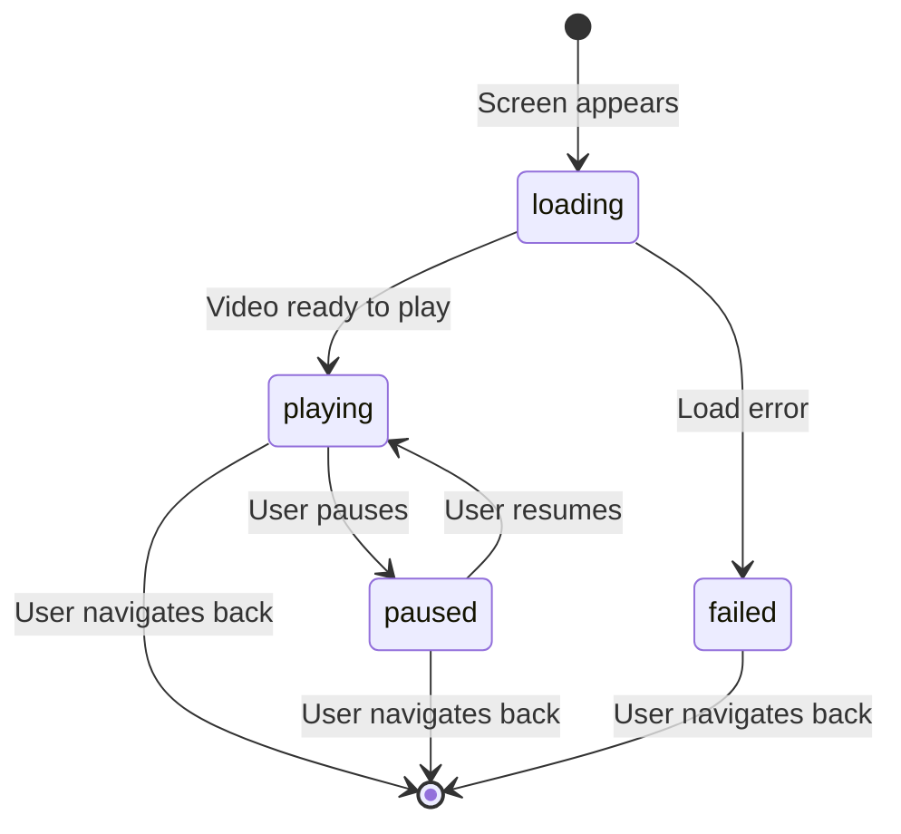

# Data Model: Video Playback Screen

**Feature**: 007-video-playback-screen  
**Date**: 2026-03-27

## Entities

### VideoPlaybackState

Represents the current state of video playback on the player screen.

| State | Description |
|-------|-------------|
| `loading` | The video is being fetched and buffered. A loading indicator is shown. |
| `playing` | The video is actively playing. Standard playback controls are available. |
| `paused` | The user has paused playback. Play button is shown to resume. |
| `failed(error)` | The video failed to load or play. An error message is shown to the user. |

**State Transitions**:

### StatusReportVideo (Placeholder)

For this feature, the status report video is represented by a single hardcoded URL. In future stories, this will become a full entity populated from the backend.

| Field | Type | Description |
|-------|------|-------------|
| `url` | URL | The HLS stream URL for the video |

**Current Value**: `https://customer-j8jlsnmsytg4ne2z.cloudflarestream.com/2916cde874951283bc3cc8b7f3f9a9ba/manifest/video.m3u8`

## Relationships

- `VideoPlaybackScreen` displays one `StatusReportVideo` at a time.
- `MainView` navigates to `VideoPlaybackScreen` with a hardcoded `StatusReportVideo` URL.
- The `VideoPlaybackState` is internal to the playback screen and not persisted.

## Validation Rules

- The video URL must be a valid URL (non-nil, well-formed).
- No user input is validated for this feature (read-only playback).

## Notes

- No database persistence is involved in this feature.
- The `StatusReportVideo` entity will be expanded in a future story with fields like `id`, `creator`, `createdAt`, `duration`, etc.
